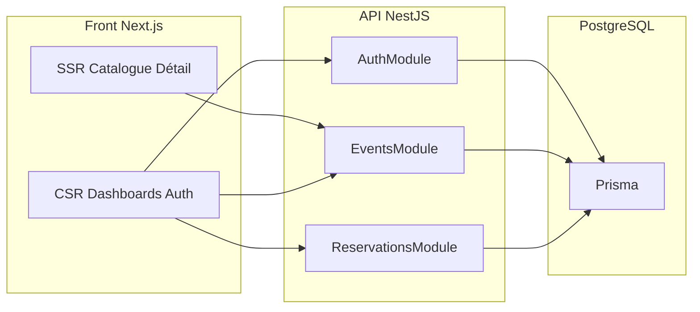
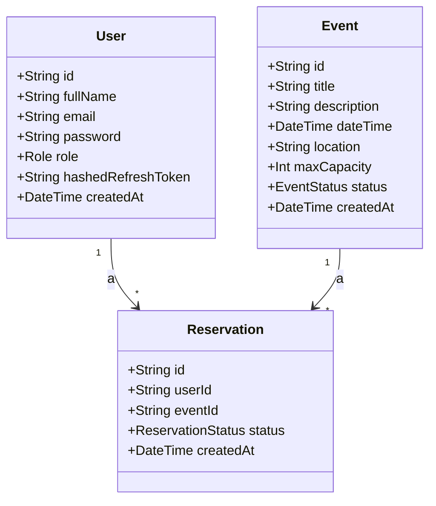

# Architecture globale – EvenTaro

## Vue d’ensemble

EvenTaro est une application de gestion d’événements et de réservations, organisée en **monorepo** :

- **apps/api** : API REST NestJS (TypeScript), base PostgreSQL, Prisma
- **apps/web** : interface Next.js 16 (App Router), TypeScript, Tailwind CSS

Les utilisateurs ont deux rôles : **ADMIN** (gestion des événements et des réservations) et **USER** (consultation des événements publiés, réservations, annulation dans les règles).

## Flux général

## Back-end (NestJS)

- **Modules** : Auth (JWT + refresh), Users, Events, Reservations, Prisma
- **Sécurité** : JWT en Bearer, refresh token stocké (hash) en base ; guards par rôle (ADMIN / USER)
- **Erreurs** : filtre d’exceptions global (HTTP et Prisma) pour codes et messages cohérents
- **Validation** : DTOs avec class-validator sur toutes les entrées

## Front-end (Next.js)

- **Public (SSR)** : page d’accueil, liste des événements publiés (`/events`), détail d’un événement (`/events/[id]`)
- **Authentifié (CSR)** : login, register, dashboard (mes réservations), dashboard admin (événements, réservations, indicateurs)
- **État global** : Context API (AuthContext) pour utilisateur, tokens, rôle
- **API** : client `api` avec intercepteur 401 → refresh token puis retry

## Diagramme de classes (entités principales)

**Enums :**

- **Role** : ADMIN, USER
- **EventStatus** : DRAFT, PUBLISHED, CANCELLED
- **ReservationStatus** : PENDING, CONFIRMED, REFUSED, CANCELLED

## Déploiement

- **Docker** : trois services (web, api, db) définis dans `docker-compose.yml` et `docker-compose.dev.yml`
- **CI/CD** : GitHub Actions (`.github/workflows/ci.yml`) sur push/PR vers main ou develop : lint, tests unitaires, build pour l’API et le front-end
